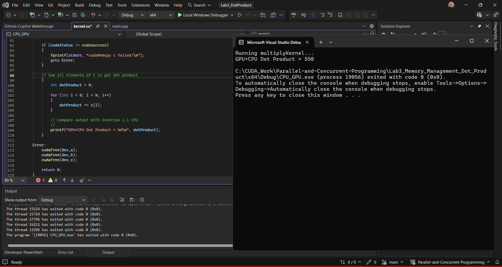
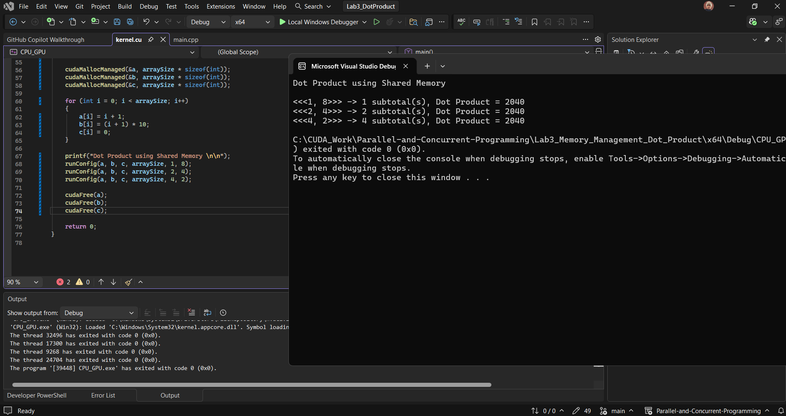

# 500083 Lab Book

## Week 3 - Lab 3 Memory Management & Dot Product

17 Feb 2026

---

### Exercise 1: Dot Product, CPU Baseline and CPU+GPU Solution

---

#### Exercise 1.1: CPU-Only Dot Product

**Question:**

Write a standard C++ CPU-only program to compute the dot product of vectors A and B. This acts as a Gold Standard to verify GPU results later.

Dot product formula: `result = A[0]*B[0] + A[1]*B[1] + ... + A[n-1]*B[n-1]`

**Solution:**

Created as a separate C++ Console Application project (`main.cpp`) in Visual Studio, no CUDA required.

```cpp
int main() {
    const int N = 5;

    int a[N] = { 1, 2, 3, 4, 5 };
    int b[N] = { 10, 20, 30, 40, 50 };

    int result = 0;

    for (int i = 0; i < N; i++)
    {
        result += a[i] * b[i];
    }

    printf("CPU Dot Product = %d\n", result);
    return 0;
}
```

**Test data:**

A = {1, 2, 3, 4, 5}, B = {10, 20, 30, 40, 50}

Expected: (1×10) + (2×20) + (3×30) + (4×40) + (5×50) = 10 + 40 + 90 + 160 + 250 = **550**

**Sample output:**

```
CPU Dot Product = 550
```


---

#### Exercise 1.2: CPU+GPU Dot Product

**Question:**

Accelerate the dot product using CUDA by splitting the work into two steps:
1. **GPU**: Compute `C[i] = A[i] * B[i]` in parallel, one thread per element
2. **CPU**: Sum all elements of C to produce the final dot product

**Solution:**

```cpp
__global__ void multiplyKernel(int* c, const int* a, const int* b) {
    int i = threadIdx.x;
    c[i] = a[i] * b[i];
}
```

Kernel launch with 1 block and N threads:

```cpp
multiplyKernel<<<1, N>>>(dev_c, dev_a, dev_b);
```

After copying C back to host, the CPU sums the result:

```cpp
int dotProduct = 0;
for (int i = 0; i < N; i++) {
    dotProduct += c[i];
}
```

**Test data:**

A = {1, 2, 3, 4, 5}, B = {10, 20, 30, 40, 50}

C after GPU multiply = {10, 40, 90, 160, 250}

Dot product (CPU sum) = **550**

**Sample output:**

```
Launching multiplyKernel...
GPU+CPU Dot Product = 550
```



---

**Reflection:**

I started with the CPU-only version to get a fixed answer before writing any GPU code. A sequential loop is straightforward enough to trust, so it made a reliable baseline to work towards.

For Exercise 1.2, I split the work between the two processors. I used `threadIdx.x` in the kernel to give each thread its own index, so all five multiplications ran in parallel on the GPU, whilst the CPU summed the results after I copied them back with `cudaMemcpy`. The workflow followed the same pattern as Lab 1. Both approaches produced **550**, which confirmed the GPU was computing correctly.

**Questions:**

None.

---

### Exercise 2: Vector Dot-Product using Unified Memory

---

#### Exercise 2.1: Dynamic Managed Memory

**Question:**

Simplify the Exercise 1.2 CUDA program by replacing explicit memory management with Unified Memory. Use `cudaMallocManaged()` to allocate memory accessible by both the CPU and GPU, removing the need for any `cudaMemcpy` calls.

**Solution:**

```cpp
int* a, * b, * c;

cudaMallocManaged(&a, arraySize * sizeof(int));
cudaMallocManaged(&b, arraySize * sizeof(int));
cudaMallocManaged(&c, arraySize * sizeof(int));

for (int i = 0; i < arraySize; i++)
{
    a[i] = i + 1;
    b[i] = (i + 1) * 10;
    c[i] = 0;
}

PerElement_AtimesB<<<1, arraySize>>>(c, a, b);
cudaDeviceSynchronize();

int dotProduct = 0;
for (int i = 0; i < arraySize; i++)
    dotProduct += c[i];

cudaFree(a);
cudaFree(b);
cudaFree(c);
```

**Test data:**

A = {1, 2, 3, 4, 5}, B = {10, 20, 30, 40, 50}

Dot product = **550**

**Sample output:**

```
Launching PerElement_AtimesB...
Dot Product (Dynamic Unified Memory) = 550
```


---

#### Exercise 2.2: Static Managed Memory

**Question:**

Compute the dot product using `__device__ __managed__` to declare global unified memory variables. This removes the need for `cudaMalloc`, `cudaMemcpy`, and `cudaFree` entirely.

**Solution:**

```cpp
__device__ __managed__ int a[5];
__device__ __managed__ int b[5];
__device__ __managed__ int c[5];

__global__ void PerElement_AtimesB(int* c, int* a, int* b)
{
    int i = threadIdx.x;
    c[i] = a[i] * b[i];
}

int main()
{
    for (int i = 0; i < 5; i++)
    {
        a[i] = i + 1;
        b[i] = (i + 1) * 10;
        c[i] = 0;
    }

    PerElement_AtimesB<<<1, 5>>>(c, a, b);
    cudaDeviceSynchronize();

    int dotProduct = 0;
    for (int i = 0; i < 5; i++)
        dotProduct += c[i];

    printf("Dot Product Static Managed Memory = %d\n", dotProduct);
}
```

**Test data:**

A = {1, 2, 3, 4, 5}, B = {10, 20, 30, 40, 50}

Dot product = **550**

**Sample output:**

```
Launching PerElement_AtimesB...
Dot Product Static Managed Memory = 550
```


---

**Reflection:**

In Exercise 2.1, I replaced `cudaMalloc` with `cudaMallocManaged`, which gave me a single pointer that worked on both the CPU and GPU without needing `cudaMemcpy` at all. I still needed `cudaDeviceSynchronize()` before reading the results on the CPU, but everything else was handled automatically.

In Exercise 2.2, I went further by declaring the arrays globally with `__device__ __managed__`, which removed `cudaMalloc` and `cudaFree` as well. The code was much shorter and I could see clearly how much of Exercise 1 was just managing memory transfers rather than doing any real computation. Both produced **550**, matching the CPU result from Exercise 1.1.

**Questions:**

None.

---

### Exercise 3: Vector Dot-Product using Shared Memory

**Question:**

Improve GPU utilisation by using shared memory to compute per-block subtotals rather than copying every multiplication result back to the CPU individually. The kernel stores each thread's product in fast on-chip shared memory, Thread 0 of each block reduces them into a single subtotal stored in `c[blockIdx.x]`, and the CPU sums only the subtotals.

Three launch configurations are tested on 8 elements:
- `<<<1, 8>>>` produces 1 subtotal
- `<<<2, 4>>>` produces 2 subtotals
- `<<<4, 2>>>` produces 4 subtotals

**Solution:**

```cpp
__global__ void dotProductShared(int* c, int* a, int* b)
{
    __shared__ int dataPerBlock[8];

    int i = blockIdx.x * blockDim.x + threadIdx.x;

    dataPerBlock[threadIdx.x] = a[i] * b[i];

    // Ensure all threads have written before Thread 0 reads
    __syncthreads();

    if (threadIdx.x == 0)
    {
        int subtotal = 0;
        for (int k = 0; k < blockDim.x; k++)
            subtotal += dataPerBlock[k];
        c[blockIdx.x] = subtotal;
    }
}
```

CPU sums the subtotals after `cudaDeviceSynchronize()`:

```cpp
int dotProduct = 0;
for (int i = 0; i < numBlocks; i++)
    dotProduct += c[i];
```

**Test data:**

A = {1, 2, 3, 4, 5, 6, 7, 8}, B = {10, 20, 30, 40, 50, 60, 70, 80}

A×B = {10, 40, 90, 160, 250, 360, 490, 640}, Dot product = **2040**

`<<<2, 4>>>` breakdown:
- Block 0 (elements 0 to 3): 10 + 40 + 90 + 160 = **300**
- Block 1 (elements 4 to 7): 250 + 360 + 490 + 640 = **1740**
- CPU: 300 + 1740 = **2040**

**Sample output:**

```
Dot Product using Shared Memory:

<<<1, 8>>> -> 1 subtotal(s), Dot Product = 2040
<<<2, 4>>> -> 2 subtotal(s), Dot Product = 2040
<<<4, 2>>> -> 4 subtotal(s), Dot Product = 2040
```


**Reflection:**

I found this the most interesting exercise in the lab. Instead of sending all the multiplication results back to the CPU to sum, I had the GPU compute subtotals per block using shared memory, which is on-chip and much faster than global memory.

Each thread writes its product into `dataPerBlock`, then I used `__syncthreads()` to make sure every thread had finished writing before Thread 0 read through the array and summed it. Without that barrier, Thread 0 could have read a value before another thread had written it, giving a wrong result. Thread 0 then stores the subtotal in `c[blockIdx.x]`, so the CPU only has to add one value per block rather than one per element.

All three configurations returned **2040**, which confirmed the approach was correct regardless of how the work was split across blocks.

**Questions:**

None.
